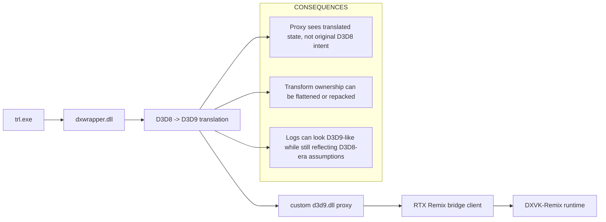
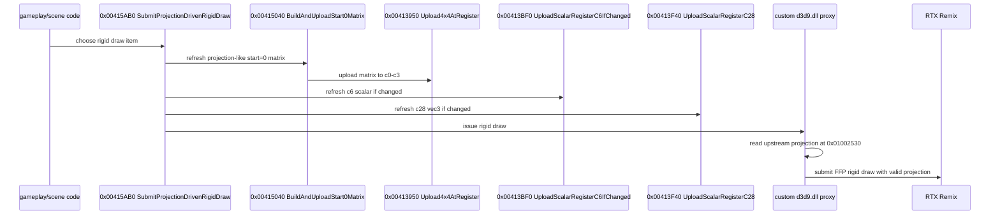

# Tomb Raider Legend RTX Remix Path Tracing Paper

## Abstract
This paper documents how Tomb Raider Legend was brought into a path-tracing-capable state under RTX Remix by combining static reverse engineering, live tracing, targeted proxy changes, and configuration control.

The central result is not that Tomb Raider Legend was turned into a complete fixed-function title in one step. The real result is narrower and more valuable: the repository reached a reproducible state where the rigid `stride0=24` geometry path can enter fixed-function mode under the custom D3D9 proxy, and RTX Remix can render that path with path tracing because the proxy now feeds a valid upstream projection source instead of waiting for a camera block that never becomes valid on the active rigid draw family.

The core insight was that the active rigid path in Tomb Raider Legend does not expose a trustworthy `WORLD/VIEW/PROJECTION` triple in the way a stock D3D9 fixed-function conversion template expects. Tomb Raider Legend is a D3D8 renderer translated to D3D9 by `dxwrapper.dll`, so the apparent D3D9 state seen by the proxy is already the result of an intermediate translation layer. That translation flattened the original render conventions enough that old fixed-function assumptions stopped being reliable.

The final working pivot was to reverse engineer the active rigid path upstream of the D3D9 proxy, identify the authoritative upstream projection matrix at `0x01002530`, and consume that source directly in the proxy. That change replaced the earlier strategy of inferring camera validity from a zero-heavy `c8-c15` block or treating `c0-c3` as a fused world-view-projection transform.

## Problem Statement
The project started with this practical goal:

1. Make Tomb Raider Legend render meaningfully under RTX Remix.
2. Keep the game stable under the proxy and chain-loaded Remix stack.
3. Recover enough transform ownership that Remix can see a valid camera and path-trace the world geometry.

The project quickly turned into a harder research problem:

- Tomb Raider Legend is not a native D3D9 title.
- `dxwrapper.dll` translates the game from D3D8 to D3D9 before the proxy sees anything.
- The active rigid draw family does not present a clean `WORLD`, `VIEW`, and `PROJECTION` split at the proxy boundary.
- Several transform hypotheses looked plausible in logs but failed in practice.

## Why This Game Is Hard
The primary difficulty is architectural, not incidental.

This matters because a stock DX9 shader-to-fixed-function conversion template assumes that the game's D3D9 shader constants map relatively directly to high-level transforms. In Tomb Raider Legend, that assumption is sometimes true, sometimes incomplete, and often wrong on the draw family that actually matters for Remix.

## Research Method
The project succeeded because it stopped trying to solve everything at once.

The investigation method eventually converged on the following loop:

1. Prove which part of the stack is failing.
2. Separate runtime architecture failures from transform-ownership failures.
3. Use static analysis to find candidate owners of VS constant uploads.
4. Use live tracing to classify which candidates actually run on real rigid geometry.
5. Refactor the proxy to consume the upstream source that is actually active.
6. Rebuild, sync, run, and inspect evidence again.

This method sounds obvious in hindsight, but the history of the project shows why it mattered: several earlier branches over-trusted a single log or a single transform interpretation and ended up encoding the wrong model into the proxy.

## What Was Proven Early
The early work established three facts that shaped the rest of the project:

1. The chain `trl.exe -> dxwrapper.dll -> custom d3d9.dll -> RTX Remix bridge` can work.
2. The game can render normally with the proxy in passthrough mode.
3. The failure is specifically in the fixed-function conversion logic, not in DLL injection, chain loading, or the existence of the proxy itself.

That eliminated a large class of dead-end debugging paths.

## The Important Failed Models
The project accumulated several plausible but wrong transform stories before the current working solution.

### Failure A: Naive Separate Matrix Mapping
An early model assumed:

- `c0-c3 = projection`
- `c8-c11 = view`
- `c12-c15 = world`

This did not produce stable world rendering. In practice it led to black screens, empty scenes, or Remix hook success without useful path-traced geometry.

### Failure B: Identity World Everywhere
Another model assumed that the game's per-object world transforms were already effectively baked into the active path and that the proxy should simply force `WORLD = identity`.

That did not stabilize the geometry either.

### Failure C: Fused WVP as the Whole Answer
The later `patches/TombRaiderLegend` branch treated `c0-c3` as a fused per-draw `WORLDVIEWPROJECTION` matrix, set `VIEW` and `PROJECTION` to identity, and relied on `rtx.fusedWorldViewMode` experimentation.

This was a useful research branch, but it still did not produce a robust result. It was especially vulnerable because it depended on Remix agreeing with the proxy's transform interpretation rather than the proxy consuming a clearly validated upstream source.

## The Pivot That Mattered
The decisive change in strategy was to stop treating the D3D9 proxy boundary as the only truth source.

Instead of asking:

"Which proxy-side constant block looks like a camera?"

the better question became:

"What upstream code actually owns the projection and camera-related uploads before the D3D8-to-D3D9 translation makes them ambiguous?"

That pivot produced the plan documented in `.cursor/plans/trl_camera_pivot_78a99665.plan.md`.

## Static Findings That Supported the Pivot
Static analysis established several candidate upload paths:

- `0x00ECBA40` is a tiny helper around `SetVertexShaderConstantF`.
- `0x00ECBB00` uploads a paired matrix block and had originally looked important.
- `0x0060C7D0`, `0x0060EBF0`, and `0x00610850` looked like promising higher-level callers.

These were good candidates, but they were not the whole truth.

## Live Trace Findings That Changed the Model
The project only crossed the line into a working result once live traces were trusted more than old log interpretations.

### Repeated Upload Patterns
Across captures, the active upload patterns kept returning:

- `start=0, count=4`
- `start=6, count=1`
- `start=28, count=1`
- rare `start=8, count=8`

The meaning of those patterns mattered more than the mere presence of uploads.

### The Active Rigid Path Did Not Use the Expected Callers
Wide capture on the active rigid scene showed that the repeated `start=0/6/28` traffic did **not** enter `0x0060C7D0`, `0x0060EBF0`, or `0x00610850` directly on the draw family we cared about.

Instead, the live traffic flowed through a helper family:

- `0x00413950` `Upload4x4AtRegister`
- `0x00413BF0` `UploadScalarRegisterC6IfChanged`
- `0x00413F40` `UploadScalarRegisterC28`
- `0x00413F80` `UploadAuxBlockC8FromGlobals`
- `0x00415040` `BuildAndUploadStart0Matrix`
- `0x00415260` `UploadFrameProjectionAndAuxBlock`
- `0x00415AB0` `SubmitProjectionDrivenRigidDraw`

### The Meaning of the Helper Family
This family changed the interpretation of the active path:

### What `c8-c15` Turned Out To Be
`0x00413F80` was particularly important because it destroyed the old camera assumption.

That function reads from `0x10FA280..0x10FA2F8` and uploads eight XYZ vectors padded to four floats. In other words:

- the `start=8, count=8` block is real,
- but on the active rigid path it is auxiliary/frustum-style data,
- not a plain camera matrix block that the proxy should treat as `VIEW` and `VIEWPROJECTION`.

That is why waiting for `c8-c15` to become a meaningful camera source was the wrong gate.

## The Decisive Upstream Source
The most important upstream source recovered during the pivot was:

- `0x01002530`, now recorded as `g_upstreamProjectionMatrix`

This global is the authoritative row-major projection matrix used by the active rigid path **before** `Upload4x4AtRegister()` transposes it into `c0-c3`.

That was the breakthrough because it converted a heuristic problem into a direct data ownership problem.

## The Working Proxy Change
The final working change in `patches/trl_legend_ffp/proxy/d3d9_device.c` did three things:

1. It stopped treating the active rigid path as a fused-WVP path.
2. It stopped gating FFP entry on a nonzero `c8-c15` camera block.
3. It started reading `0x01002530` directly and feeding that data into `D3DTS_PROJECTION`.

On this path, the proxy currently uses:

- `WORLD = identity`
- `VIEW = identity`
- `PROJECTION = g_upstreamProjectionMatrix`

This is not the final world/view solution. It is the working solution that unlocked path tracing on the active rigid path.

## Why The Working Change Was Enough
The new proxy logic succeeded because the rigid path apparently needed a valid projection source more urgently than a fully reconstructed view stack.

The earlier camera failure state looked like this:

- `start=0` matrix existed
- `c8-c15` was zero
- the proxy's camera-validity logic stayed unconvinced
- rigid draws stayed out of FFP or entered it under the wrong assumptions

The later working state looked like this in the runtime log:

- `start0Seen=1`
- `projectionReady=1`
- `stride0=24`
- `rigidDecl=1`
- `canUseFfp=1`
- `usedFfp=1`

That proves the proxy stopped blocking on the wrong source and started converting the rigid path it was meant to convert.

## Evidence Table
The most important evidence and the question each artifact answered are listed below.

| Artifact | Question it answered | Result |
| --- | --- | --- |
| `patches/trl_legend/trace_vsconst_hist.jsonl` | Which VS upload patterns dominate? | `start=0`, `start=6`, `start=28` dominate; `start=8` is rarer |
| `patches/trl_legend/trace_reg0.jsonl` | Is `start=0` always one kind of matrix? | No. It can look projection-like or carry translated values |
| `patches/trl_legend_ffp/upstream_camera_capture.jsonl` | Do the original `0x0060xxxx` callers own the active rigid path? | Not directly on the active rigid family |
| `patches/trl_legend_ffp/wrapper_callers_capture.jsonl` | Which tiny wrappers dominate active rigid uploads? | `0x00413950`, `0x00413BF0`, `0x00413F40`, `0x00413F80` |
| `patches/trl_legend_ffp/matrix_owner_capture.jsonl` | Who owns the active `start=0` path? | `0x00415B31` dominates; `0x0041536D` is the rarer frame-level path |
| `A:\SteamLibrary\steamapps\common\Tomb Raider LegendFIRSTVIBECODE\ffp_proxy.log` | Did the new proxy actually enter FFP on rigid draws? | Yes. `canUseFfp=1` and `usedFfp=1` appear on `stride0=24` rigid draws |

## Worked / Failed Matrix
The table below is the shortest summary of the whole journey.

| Hypothesis or change | What it meant | Outcome | Why it matters |
| --- | --- | --- | --- |
| Passthrough proxy | Chain load only, no FFP conversion | Worked | Proved injection and chain loading were not the root problem |
| `c8-c15` as camera block | Trust old view/view-proj interpretation | Failed on active rigid path | The block was often zero or auxiliary on the path that mattered |
| `c0-c3` as fused WVP | Treat the active matrix as combined world-view-projection | Useful intermediate idea, but not enough | It still relied on a transform interpretation that was too broad |
| Upstream helper pivot | Trace callers above `SetVertexShaderConstantF` | Worked as an investigation method | Revealed the real active rigid helper family |
| Direct upstream projection feed from `0x01002530` | Read authoritative projection data before proxy-side ambiguity | Worked | This was the enabling change that let rigid draws enter FFP under a valid projection source |

## What The Current Success Is
The current success should be described precisely.

It is **not**:

- full fixed-function coverage for every draw family,
- full world/view ownership recovery,
- or a completed Tomb Raider Legend RTX Remix port.

It **is**:

- a reproducible build,
- a reproducible deployment workflow,
- a valid path-tracing-capable rigid draw path,
- a proxy that no longer blocks on the wrong camera source,
- and a reverse engineering base that future work can extend instead of restarting.

## What Still Needs To Be Solved
The following major questions remain open:

1. What is the cleanest authoritative upstream `VIEW` source for the gameplay camera?
2. What is the cleanest authoritative upstream `WORLD` source for rigid geometry?
3. Are `c6` and `c28` only companions to the rigid path, or do they become necessary for more draw families?
4. What should the proxy do for skinned meshes beyond pass-through?
5. How many distinct draw families need separate fixed-function strategies?

The current repository can now chase those questions from a working rendering state instead of from a broken one.

## Why This Matters For Future Work
The project is now in a fundamentally better state because the expensive uncertainty has moved.

Before the current work, the uncertainty was:

- "Why does Remix still say there is no valid camera?"

After the current work, the uncertainty is:

- "How do we turn the now-working rigid path into a more complete, cleaner, and more general fixed-function port?"

That is a much better problem.

## Final Conclusion
Tomb Raider Legend was brought into a path-tracing-capable state under RTX Remix by abandoning the assumption that the D3D9 proxy boundary exposed a clean camera transform and by recovering the active rigid path's upstream projection owner directly from the game.

The working solution did not come from a more clever fused-WVP heuristic. It came from a narrower, evidence-driven answer:

- find the real active rigid helper family,
- find the authoritative upstream projection source,
- feed that source directly into the proxy,
- and let rigid geometry enter FFP under a configuration that the runtime can actually use.

That is the key lesson of the project so far. Tomb Raider Legend was not solved by guessing better inside the proxy. It was solved by moving upstream until the proxy had something real to trust.
