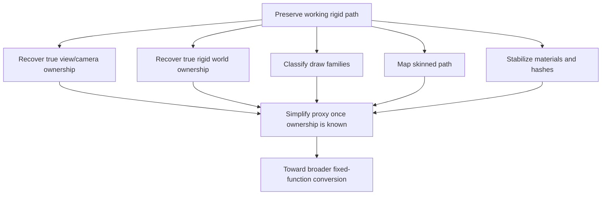

# Tomb Raider Legend RTX Remix Reverse Engineering Roadmap

## Mission
The current working repository state is not the end goal. It is the launch platform for the next phase.

The long-term objective is:

1. Preserve the current working path-tracing-capable rigid path.
2. Recover the remaining authoritative transform ownership cleanly.
3. Expand fixed-function coverage beyond the first rigid declaration family.
4. Reduce hacks and make the proxy easier to reason about and maintain.

In short:

go from **"Remix can render the rigid path"** to **"TRL is systematically understood and intentionally converted."**

## Current State Summary
The repository now has a working rigid path because:

- the proxy can chain into Remix,
- the proxy can enter FFP on the rigid `stride0=24` draw family,
- the proxy uses the upstream projection matrix at `0x01002530`,
- and the runtime log proves `canUseFfp=1` and `usedFfp=1`.

The repository is **not** yet in a fully mapped state because:

- the true gameplay `VIEW` source is still not cleanly formalized,
- the true gameplay `WORLD` source is still not cleanly formalized,
- skinned geometry still defaults to shader pass-through,
- and several companion values (`c6`, `c28`, `c8-c15`) are active but not fully semantically decoded.

## Strategic Model
The correct strategy is to treat this as multiple parallel workstreams, not a single monolithic puzzle.

## Principle For Future Work
Every future change should obey this rule:

**Do not give up the working rigid path to chase a cleaner theory.**

The current path-tracing-capable state is the baseline. Future work should branch from it, preserve it, and expand it.

## Phase 1: Freeze And Protect The Working Baseline
This phase is about preventing regression.

### Goals
- Preserve the current working proxy behavior.
- Preserve the current working runtime configuration.
- Preserve the current working deployment workflow.
- Preserve the supporting evidence.

### Tasks
1. Keep using `checkpoint.py` before every major proxy experiment.
2. Preserve the current `proxy.ini`, `rtx.conf`, `user.conf`, and `dxwrapper.ini` as a known-good baseline.
3. Keep `ffp_proxy.log` samples from known-good sessions.
4. Keep the current trace artifacts with their purpose documented.

### Deliverables
- known-good runtime snapshot
- reproducible build and sync workflow
- stable checkpoint discipline

## Phase 2: Recover True Gameplay Camera Ownership
This is the most important unresolved technical problem.

### What Is Known
- The rigid path works with the upstream projection matrix at `0x01002530`.
- The old `c8-c15` block is not the active camera source for the rigid path.
- The original `0x0060C7D0`, `0x0060EBF0`, and `0x00610850` candidates are not the direct dominant owners on the traced rigid draw family.

### What Is Still Unknown
- The cleanest authoritative gameplay `VIEW` source.
- Whether the true gameplay camera is available as a matrix, a position/orientation bundle, or an earlier transform stack.

### Recommended Method
1. Trace from the active rigid owner `0x00415AB0` outward, not inward.
2. Capture the parent scene or camera logic that determines `start0ZOffset`, `c6Value`, and `companionVec3`.
3. Trace writers around `0x01002530` in a gameplay level while moving the camera deliberately.
4. Compare the upstream matrix changes against expected camera motion and field-of-view changes.

### Tool Plan
- `livetools collect` on owner and helper functions in a live gameplay scene
- `retools.xrefs` and `callgraph --up` on `0x00415040` and `0x00415AB0`
- `datarefs.py` on `0x01002530`
- targeted decompilation around parent callsites

### Success Criteria
- name the true upstream camera or view owner
- describe whether it is matrix-based or derived
- decide whether the proxy should read it directly or continue using identity view

## Phase 3: Recover True Rigid World Ownership
The current working path still leaves `WORLD = identity`.

### Why This Matters
The current result proves the projection side was the major blocker, but that does not prove identity world is correct in the general case. A cleaner and broader fixed-function port will eventually need authoritative rigid world ownership.

### Working Hypothesis
The companion fields around the `0x00415AB0` draw item likely contribute to the real world placement problem:

- `+0x24` feeding `c6`
- `+0x28` feeding the `start=0` build path
- `+0x18` feeding `c28`

### Tasks
1. Trace where `TrlProjectionDrawItem.start0ZOffset` is populated.
2. Trace where `TrlProjectionDrawItem.c6Value` is populated.
3. Trace where `TrlProjectionDrawItem.companionVec3` is populated.
4. Determine whether those values represent:
   - translation,
   - depth bias,
   - frustum relationship,
   - per-instance offset,
   - or some other projection-derived companion state.

### Success Criteria
- decide whether world can remain identity,
- or whether a true world matrix or offset reconstruction is needed.

## Phase 4: Classify Draw Families
The project should stop talking about "the game" as if it had one transform model.

### Draw Families To Separate
- rigid world geometry
- skinned characters
- UI
- world-space UI
- particles
- water
- post-process or screen-space effects
- shadow or auxiliary passes

### Why This Matters
Each of these families may have different:

- declaration layouts,
- shader constant semantics,
- texture classification behavior,
- and proxy requirements.

### Tasks
1. Build a draw-family classification table keyed by:
   - declaration pointer
   - shader pointer
   - stream stride
   - texture pattern
   - upload pattern
2. Associate those families with specific gameplay scenes.
3. Mark which families are:
   - already working in FFP,
   - should remain pass-through,
   - or need a different fixed-function strategy.

### Success Criteria
- a draw-family map that explains where the current proxy applies and where it does not

## Phase 5: Map Skinned Geometry
Skinned meshes are currently not the mainline success path.

### Current State
- `ENABLE_SKINNING = 1` exists in the proxy
- skinned draws still default to shader pass-through unless explicitly forced

### Why This Should Be A Separate Workstream
The rigid-path success came from not mixing too many problems together. Character skinning should be handled after the rigid-world path is understood well enough to protect.

### Tasks
1. Identify the dominant skinned declarations and bone palette uploads.
2. Confirm whether the current bone threshold assumptions are correct for TRL.
3. Decide whether skinned meshes should:
   - stay in pass-through,
   - use partial FFP support,
   - or require an alternate strategy entirely.

### Success Criteria
- documented skinned path with either a safe pass-through policy or a realistic conversion strategy

## Phase 6: Material And Hash Stabilization
Path tracing is not only about transforms.

### What Already Exists
- curated texture lists in `user.conf`
- forced stage 0 albedo logic
- optional normal-map suppression
- sampler state stabilization

### What Still Needs Work
- formal documentation for every hash list purpose
- clearer mapping from texture classes to gameplay materials
- validation that the current rigid path remains stable across more scenes

### Tasks
1. Build a texture taxonomy document keyed to `user.conf`.
2. Capture scene-specific examples of which textures are:
   - UI
   - sky
   - decals
   - water
   - ignored
3. Record which hash stabilizations are essential and which are provisional.

## Phase 7: Simplify The Proxy
The proxy should eventually reflect what the game actually does, not the history of the investigation.

### Proxy Cleanup Goals
- remove obsolete camera-validity heuristics
- remove stale terminology that suggests old transform models
- isolate rigid, skinned, and auxiliary routing logic more cleanly
- reduce the cognitive load of `WD_DrawIndexedPrimitive`

### Conditions Before Cleanup
Do not heavily simplify the proxy until:

1. the current rigid path is stable across multiple levels,
2. the real gameplay camera path is better understood,
3. and the world-placement story is less ambiguous.

## Instrumentation Cookbook
Use the following questions to decide what to trace next.

### If you want the true view/camera source
- trace writers and readers around `0x01002530`
- trace parents of `0x00415AB0`
- collect camera movement in a real 3D level

### If you want the true world source
- trace `+0x18`, `+0x24`, and `+0x28` fields of the active draw item owner
- correlate those fields against per-object movement and placement

### If you want to classify draw families
- collect declaration pointers and shader pointers together
- group by `stride0`, decl layout, and upload pattern

### If you want to validate rigid-path health
- search `ffp_proxy.log` for:
  - `stride0=24`
  - `rigidDecl=1`
  - `projectionReady=1`
  - `usedFfp=1`

## Recommended Milestone Order
Follow this order to maximize progress while minimizing regression risk.

1. Preserve and validate the current rigid success state.
2. Recover true gameplay camera ownership.
3. Recover true rigid world ownership.
4. Expand draw-family classification.
5. Decide what to do about skinned geometry.
6. Simplify the proxy only after the above are better understood.

## Concrete Next Experiments

### Experiment 1: Writer-Centric Projection Study
Goal:
confirm exactly who writes `0x01002530` in a real gameplay scene and whether that source changes with:

- camera rotation,
- field of view,
- cutscenes,
- and room transitions.

Expected output:
- named writer function
- named parent owner chain
- confidence statement about projection ownership

### Experiment 2: Draw Item Field Semantics
Goal:
decode the semantic meaning of the `0x00415AB0` item fields:

- `+0x18`
- `+0x24`
- `+0x28`

Expected output:
- field names in the KB
- statement of whether those fields belong to world placement, projection shaping, or auxiliary scene logic

### Experiment 3: Multi-Level Rigid Validation
Goal:
verify that the current projection-driven rigid path works in more than one gameplay area.

Expected output:
- per-level validation notes
- known-good vs problematic scenes
- clues about whether the current path is general or level-specific

## Risks To Avoid
Future work should avoid repeating the mistakes that consumed time earlier in the project.

1. Do not assume a single matrix theory covers every draw family.
2. Do not regress the current rigid path just to pursue elegance.
3. Do not over-trust one log when live traces disagree.
4. Do not conflate "projection solved" with "camera solved."
5. Do not mix skinned-path work into rigid-path cleanup until the rigid path is better locked down.

## Deliverables That Would Make The Project Easier To Continue
These are the best "other things to add" once the current roadmap is underway:

- a per-level draw-family coverage sheet
- a texture classification handbook derived from `user.conf`
- a named Ghidra project or symbol export
- a proxy log parser that summarizes rigid-path health automatically
- a regression checklist for every major proxy change
- a scene capture notebook with screenshots, logs, and trace links side by side

## Closing Statement
The current repository has crossed the most important threshold: it is no longer trying to solve the whole game from a broken rendering state. It now has a working rigid path and a concrete upstream projection handoff.

That means future reverse engineering can be disciplined, targeted, and incremental. The roadmap above is designed to protect that advantage.
