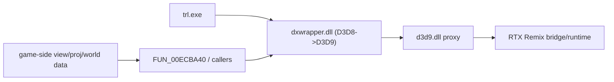

# Recover Camera Upstream

## Why This Pivot
The current D3D9 proxy path is no longer the main unknown:

- The proxy now syncs, launches, and can selectively enter FFP on the intended `stride0=24` rigid declaration path in [patches/trl_legend_ffp/proxy/d3d9_device.c](patches/trl_legend_ffp/proxy/d3d9_device.c).
- Live tracing of `FUN_00ECBA40` showed the gameplay wrapper repeatedly uploads a changing `start=0,count=4` matrix plus scalar writes at `c6` and `c28`, while `start=8,count=8` remains zero on the traced gameplay path.
- Remix is still reporting `Trying to raytrace but not detecting a valid camera` even after syncing `rtx.fusedWorldViewMode = 2` in the runtime config.

That makes the best next move an upstream camera/projection recovery pass rather than more D3D9-side heuristic remapping.

## Current Architecture

## Files To Reuse
- [patches/trl_legend_ffp/proxy/d3d9_device.c](patches/trl_legend_ffp/proxy/d3d9_device.c): current best D3D9-side routing, sync-tested runtime path, and diagnostic scaffold.
- [patches/trl_legend_ffp/kb.h](patches/trl_legend_ffp/kb.h): current matrix/upload knowledge base for `FUN_00ECBB00` and the render context.
- [TOMB_RAIDER_LEGEND_RTX_REMIX_HANDOFF.md](TOMB_RAIDER_LEGEND_RTX_REMIX_HANDOFF.md): source-of-truth history, including prior failed transform assumptions and the D3D8-via-dxwrapper runtime stack.
- [patches/trl_legend_ffp/sync_runtime_to_game.ps1](patches/trl_legend_ffp/sync_runtime_to_game.ps1): keep this deployment path as the single test sync route.

## Execution Plan
1. Trace the upstream upload/camera owners rather than the D3D9 proxy registers.
   - Focus on the confirmed callers of `FUN_00ECBB00`: `FUN_0060c7d0`, `FUN_0060ebf0`, and `FUN_00610850`.
   - Determine which caller owns gameplay camera/projection versus auxiliary or projection-only passes.
   - Map the meaning of the helper writes observed in live traces: `start=0,count=4`, `start=6,count=1`, and `start=28,count=1`.

2. Identify the earliest stable source of valid gameplay camera data.
   - Prefer game-side matrices or structs before dxwrapper translation if they remain separate and non-zero.
   - Use [patches/trl_legend_ffp/kb.h](patches/trl_legend_ffp/kb.h) as the place to record validated offsets, signatures, and matrix semantics.

3. Add a narrow upstream export path back into the current proxy.
   - Keep the existing D3D9 proxy scaffold and runtime sync workflow.
   - Replace D3D9-side camera inference with a direct feed of validated upstream view/projection/world or validated fused transform metadata.
   - Minimize surface area: one authoritative camera source, one authoritative geometry transform source.

4. Simplify `FFP_ApplyTransforms()` once the upstream source is known.
   - Remove mixed fallback heuristics that try to infer camera validity from zeroed `c8-c15` blocks.
   - Preserve the current declaration routing only if it still matches the validated geometry path.

5. Validate against explicit success criteria.
   - Proxy log: gameplay draws use the chosen transform source, not the zero-camera path.
   - Remix log: the `valid camera` error disappears.
   - Runtime behavior: path tracing appears while keeping frustum mode at `none`.

## Notes For Implementation
- Do not restart from the stock template; continue from [patches/trl_legend_ffp/proxy/d3d9_device.c](patches/trl_legend_ffp/proxy/d3d9_device.c).
- Treat [patches/TombRaiderLegend/proxy/d3d9_device.c](patches/TombRaiderLegend/proxy/d3d9_device.c) only as a reference for the fused-WVP experiment, not as the active base.
- Keep the game-directory launch and sync workflow as-is so runtime state stays reproducible across tests.