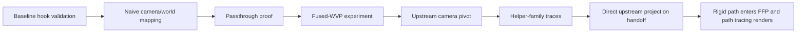

# Tomb Raider Legend RTX Remix Experiment Log

## Purpose
This file is the lab notebook for the Tomb Raider Legend RTX Remix effort. It exists because the project has already gone through multiple plausible theories, multiple proxy branches, and several rounds of contradictory evidence. A chronological experiment log makes it easier to answer:

- what was tried,
- why it was tried,
- what evidence supported it at the time,
- what ultimately proved it right or wrong,
- and what the current repository learned from it.

## High-Level Timeline

## Experiment Table

| Phase | Hypothesis | Why it seemed reasonable | Outcome | What the repo learned |
| --- | --- | --- | --- | --- |
| Baseline chain test | The issue might be DLL injection or chain loading | Many proxy projects fail at the hook layer first | False | Injection and chain loading worked; focus moved to transform ownership |
| Naive matrix mapping | `c0/c8/c12` might map directly to projection/view/world | Common enough pattern in shader-era games | Failed | TRL did not expose a clean camera triple on the active path |
| Passthrough proxy | A non-transforming proxy might stabilize the stack | Needed to isolate the fault domain | Worked | The stack itself was sound; FFP logic was the problem |
| Fused-WVP branch | `c0-c3` might be the one transform that matters | `start=0` changed constantly and looked richer than a single projection register | Incomplete / not robust | Good intermediate theory, but not the final answer |
| Upstream caller pivot | The true answer might exist before the proxy boundary | D3D8-to-D3D9 translation made proxy-side state ambiguous | Worked as a method | Upstream ownership mattered more than proxy heuristics |
| Helper-family classification | The small upload wrappers might explain the active rigid path | Live traces showed repeated `start=0/6/28` traffic | Worked | The active path flowed through wrapper helpers rather than the originally assumed `0x0060xxxx` chain |
| Direct upstream projection feed | A direct projection source might be enough to unlock FFP on the rigid path | `0x01002530` was stable and authoritative | Worked | Rigid path could enter FFP with a real projection source even without a fully solved view/world chain |

## Detailed Chronology

### 1. Prove The Stack Works At All
The earliest non-negotiable goal was to prove that the project was failing for an interesting reason and not for a basic one.

What was done:

- The proxy was reduced to a passthrough mode.
- The chain into the Remix bridge/runtime was preserved.
- The game was launched with that stack.

What happened:

- the game rendered normally,
- Remix hooked,
- but the scene still did not become meaningfully path traced.

What that proved:

- the proxy was not breaking launch,
- the chain-load architecture was not the core issue,
- and the project could move on to transform ownership.

### 2. Try Straightforward Matrix Stories
The next wave of experiments assumed that the active shader constants might map to a normal camera/world split.

This was supported by:

- the presence of `SetVertexShaderConstantF`,
- the apparently matrix-like contents of some blocks,
- and the stock fixed-function template logic.

What failed:

- direct camera/world assumptions did not produce stable geometry,
- the scene could go black or empty,
- and a log that looked convincing in one place did not generalize.

The key lesson:

TRL could not be treated like a normal DX9 game just because the proxy saw D3D9 calls.

### 3. Confirm That `c0-c3` Is Not Simple
Early traces showed that `start=0,count=4` could look projection-like in one moment and carry large translated values in another.

This mattered because it killed two bad simplifications at once:

- `c0-c3` was not always "just projection"
- `c0-c3` was not automatically "just one fused world matrix" either

This was the first clue that the project needed draw-family classification, not one universal transform story.

### 4. The Fused-WVP Detour
The later `patches/TombRaiderLegend` branch represented a serious attempt to embrace the idea that the active transform might simply be fused.

Why it was worth trying:

- `c0-c3` changed very frequently,
- the old `c8-c15` camera-style path looked weak,
- and Remix has options like `rtx.fusedWorldViewMode` that encourage experimentation.

Why it still was not enough:

- it improved the mental model,
- but it still relied too heavily on proxy-side transform interpretation,
- and it did not provide a stable general fix.

### 5. Pivot Upstream
This was the most important methodological step of the project.

Instead of asking:

"Which proxy-side block should count as the camera?"

the project began asking:

"Which upstream code actually owns the active rigid uploads before the translation layer flattens them?"

This changed the tool choice:

- more caller tracing,
- more live ownership analysis,
- less trust in old proxy logs by themselves.

### 6. Discover The Wrapper Family
Wide live capture proved that the repeated active traffic did not go where the earlier static shortlist suggested.

Instead, the active rigid path flowed through a helper family:

- `0x00413950`
- `0x00413BF0`
- `0x00413F40`
- `0x00413F80`
- `0x00415040`
- `0x00415260`
- `0x00415AB0`

This was the point where the project stopped trying to solve the game from the wrong call chain.

### 7. Separate The Rare Frame Path From The Dominant Per-Draw Path
The traces showed two different patterns:

1. A rarer frame-level path around `0x00415260`
2. A dominant per-draw path around `0x00415AB0`

This distinction mattered because:

- the rare path carried the `start=8` auxiliary block,
- while the dominant path repeatedly refreshed the `start=0` matrix plus the `c6` and `c28` companions.

That made it much less likely that `c8-c15` was the authoritative rigid-path camera source.

### 8. Recover The Real Projection Source
The decisive static and live evidence pointed to:

- `0x01002530`

This global was consumed by `0x00415040` before transposition into `c0-c3`.

That was the key because it turned the problem from:

"interpret this proxy-side matrix block correctly"

into:

"read the authoritative upstream projection matrix directly"

### 9. Rewrite The Proxy Around The Real Source
The final working proxy change did the following:

- renamed the internal logic to match the traced upload family,
- gated rigid FFP entry on `start0Seen` plus a valid upstream projection,
- read `0x01002530` directly,
- and stopped depending on the old zeroed `c8-c15` camera path.

This was the first change that aligned the proxy with the recovered upstream ownership instead of with a guessed matrix interpretation.

### 10. Confirm Success In The Log
The final confirmation came from the runtime log.

The important fields on rigid draws became:

- `stride0=24`
- `rigidDecl=1`
- `start0Seen=1`
- `projectionReady=1`
- `canUseFfp=1`
- `usedFfp=1`

That log state is the strongest concise proof that the current milestone is real.

## Named Working Evidence
These artifacts should be treated as the main evidence chain for the current result:

| Artifact | Role in the story |
| --- | --- |
| `trace_vsconst_hist.jsonl` | proves the main upload distribution |
| `trace_reg0.jsonl` | proves `start=0` is overloaded |
| `upstream_camera_capture.jsonl` | proves the original caller shortlist was not the direct active owner |
| `wrapper_callers_capture.jsonl` | proves the helper wrapper family dominates the active rigid path |
| `matrix_owner_capture.jsonl` | proves the dominant per-draw owner around `0x00415AB0` |
| `ffp_proxy.log` | proves the final proxy build entered FFP and used the upstream projection gate successfully |

## What Worked And Why

### What Worked
- passthrough proof
- upstream ownership tracing
- rigid declaration filtering
- direct upstream projection feed
- configuration discipline
- automated build and sync

### Why It Worked
- it reduced ambiguity,
- it isolated the active rigid draw family,
- and it replaced heuristics with recovered ownership.

## What Failed And Why

### What Failed
- over-trusting archived logs
- assuming native-DX9-style transform semantics
- assuming `c8-c15` would become the camera on the active rigid path
- assuming a universal transform story applied to every draw family

### Why It Failed
- TRL is mediated by D3D8-to-D3D9 translation,
- the active path is more specialized than the stock template expected,
- and the same register range can carry different meanings across different draw families or times.

## Best Lessons To Preserve
The following lessons should be treated as operating doctrine for future work:

1. Preserve working render paths even if the theory behind them is incomplete.
2. Trust live ownership traces over elegant but unvalidated proxy-side assumptions.
3. Separate draw-family classification from transform reconstruction.
4. Do not assume that a clean camera block will exist at the proxy boundary.
5. Do not restart from the stock template once TRL-specific evidence exists.

## Suggested Future Entries For This Log
The experiment log will become even more valuable if future work adds entries for:

- first multi-level validation of the working rigid path
- true gameplay view-matrix recovery
- true rigid world ownership recovery
- first successful skinned-path classification
- first documented regression and recovery
- first cleanup pass that removes obsolete transform heuristics

## Closing Note
The most important thing this log preserves is not just the final answer. It preserves the **shape of the thinking** that got to the answer. In a project like this, that matters almost as much as the code.
