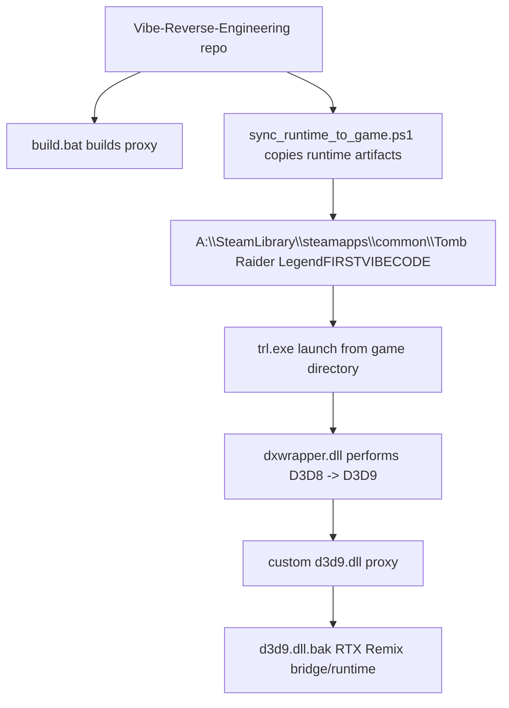

# Tomb Raider Legend RTX Remix Project Setup And Reproduction

## Goal Of This Guide
This guide explains how to reproduce the current working Tomb Raider Legend RTX Remix state from this repository.

The target outcome is:

1. Tomb Raider Legend launches through `dxwrapper.dll`.
2. The custom `d3d9.dll` proxy loads and chains into RTX Remix.
3. The proxy enters fixed-function mode on the rigid `stride0=24` path.
4. The runtime log shows `projectionReady=1`, `canUseFfp=1`, and `usedFfp=1`.
5. Path tracing renders through RTX Remix on that rigid path.

This guide is intentionally precise. It uses the exact project automation and working configuration values that were present in the repository when the working milestone was reached.

## Environment Model
The project assumes the following structure:



## Required Inputs
You need all of the following:

1. A working Tomb Raider Legend install at:
   `A:\SteamLibrary\steamapps\common\Tomb Raider LegendFIRSTVIBECODE`

2. The project repository at:
   `C:\Users\skurtyy\Documents\GitHub\TombRaiderLegendRTX\Vibe-Reverse-Engineering`

3. Visual Studio Build Tools with x86 C++ support.

4. The repo's reverse engineering dependencies installed and verified.

5. RTX Remix already staged in the game directory under the current chain-loading convention, where the bridge/runtime side is exposed through:
   `d3d9.dll.bak`

## Verify Tooling First
Before doing anything else, verify the repository environment from the repo root:

```powershell
python verify_install.py
```

The expected healthy result is:

- all checks pass,
- the RE tools import cleanly,
- and the required static and dynamic analysis toolchain is available.

Do not skip this step if you are rebuilding the environment on a different machine.

## Important Runtime Truths
These facts must remain visible while reproducing the setup:

1. `trl.exe` is effectively a D3D8 game under this project.
2. `dxwrapper.dll` translates it to D3D9 before the proxy sees it.
3. Therefore, the proxy cannot be treated as if it is sitting directly on a native D3D9 renderer.

This is confirmed by the live game config:

```ini
[Compatibility]
D3d8to9 = 1
```

If that changes, all transform conclusions in this documentation may need to be revalidated.

## Important Files And Their Roles
These are the files you will use most often.

| Path | Role |
| --- | --- |
| `patches/trl_legend_ffp/proxy/d3d9_device.c` | Main fixed-function conversion logic |
| `patches/trl_legend_ffp/proxy/d3d9_main.c` | Logging and chain loading |
| `patches/trl_legend_ffp/proxy/proxy.ini` | Proxy runtime config |
| `patches/trl_legend_ffp/proxy/build.bat` | Proxy build script |
| `patches/trl_legend_ffp/rtx.conf` | Working RTX Remix render config snapshot |
| `patches/trl_legend_ffp/sync_runtime_to_game.ps1` | Deployment automation |
| `A:\SteamLibrary\steamapps\common\Tomb Raider LegendFIRSTVIBECODE\dxwrapper.ini` | D3D8-to-D3D9 translation config |
| `A:\SteamLibrary\steamapps\common\Tomb Raider LegendFIRSTVIBECODE\user.conf` | Working RTX Remix classification and feature config |
| `A:\SteamLibrary\steamapps\common\Tomb Raider LegendFIRSTVIBECODE\ffp_proxy.log` | Runtime proof and debugging log |

## Working Configuration Snapshot

### Proxy Configuration
The working `proxy.ini` state is:

```ini
[Remix]
Enabled=1
DLLName=d3d9.dll.bak

[FFP]
AlbedoStage=0
DisableNormalMaps=1
ForceFfpSkinned=0
ForceFfpNoTexcoord=0
```

What each one means in the working state:

- `Enabled=1`
  The proxy must chain into the Remix bridge/runtime.

- `DLLName=d3d9.dll.bak`
  This is the known-good chain-load target in the current working setup.

- `AlbedoStage=0`
  The rigid path currently assumes stage 0 is the correct albedo source.

- `DisableNormalMaps=1`
  The proxy strips non-albedo texture stages during FFP draws to reduce instability and help Remix material interpretation.

- `ForceFfpSkinned=0`
  Skinned meshes still default to pass-through unless explicitly reworked.

- `ForceFfpNoTexcoord=0`
  The current success path assumes proper rigid declarations with texcoords.

### RTX Remix Runtime Config
The working `rtx.conf` snapshot includes:

- `rtx.fusedWorldViewMode = 2`
- `rtx.enableRaytracing = True`
- `rtx.useVertexCapture = True`
- `rtx.zUp = True`
- `rtx.orthographicIsUI = True`

Important note:

The current proxy no longer depends on the old fused-WVP strategy for the active rigid path. However, because the working runtime state includes `rtx.fusedWorldViewMode = 2`, the safest reproduction strategy is to keep that value in the known-good baseline until more targeted validation proves it is unnecessary.

### dxwrapper Configuration
The key required setting in `dxwrapper.ini` is:

```ini
[Compatibility]
D3d8to9 = 1
```

That setting is not optional for the current project model.

## Build Process
Build the proxy from:

`patches/trl_legend_ffp/proxy`

The build script is already automated:

```powershell
.\build.bat
```

What the script does:

1. Finds the latest Visual Studio install using `vswhere`.
2. Loads the x86 build environment with `vcvarsall.bat`.
3. Compiles:
   - `d3d9_main.c`
   - `d3d9_wrapper.c`
   - `d3d9_device.c`
4. Links `d3d9.dll`.
5. Deletes intermediate objects and import libraries.

The expected success message is:

`=== Build successful: d3d9.dll ===`

## Deploy Process
Do not manually copy runtime files one by one unless you are recovering from a broken automation script.

Use the repo's deployment script:

```powershell
powershell -NoProfile -ExecutionPolicy Bypass -File "patches/trl_legend_ffp/sync_runtime_to_game.ps1"
```

This script:

1. Collects runtime artifacts from:
   - `patches/trl_legend_ffp/`
   - `patches/trl_legend_ffp/proxy/`
2. Filters by runtime extensions such as `.dll`, `.ini`, `.cfg`, `.json`, `.toml`, and `.conf`
3. Excludes backup and build-only artifacts such as:
   - `d3d9.dll.bak`
   - `.pdb`
   - `.obj`
   - `.lib`
   - `.exp`
4. Copies the runtime files into:
   `A:\SteamLibrary\steamapps\common\Tomb Raider LegendFIRSTVIBECODE`

To sync and launch in one step:

```powershell
powershell -NoProfile -ExecutionPolicy Bypass -File "patches/trl_legend_ffp/sync_runtime_to_game.ps1" -Launch
```

## Launch Rules
Always launch `trl.exe` from the game directory, not from the repo root.

Correct working directory:

`A:\SteamLibrary\steamapps\common\Tomb Raider LegendFIRSTVIBECODE`

This matters because the game resolves `bigfile.*` assets relative to the current working directory.

If you launch from the wrong place, you can get archive-open failures such as:

`Failed to open BIGFILE.000`

## Reproduction Procedure
Follow these steps in order.

1. Verify the repo environment with `python verify_install.py`.
2. Build the proxy with `.\build.bat`.
3. Sync the runtime files with `sync_runtime_to_game.ps1`.
4. Confirm the game directory contains the expected working files:
   - `trl.exe`
   - `dxwrapper.dll`
   - `dxwrapper.ini`
   - `d3d9.dll` from the proxy
   - `d3d9.dll.bak` as the Remix bridge/runtime target
   - `proxy.ini`
   - `rtx.conf`
   - `user.conf`
5. Launch the game from the game directory.
6. Enter a real 3D gameplay scene.
7. Let the proxy diagnostics reach the delay window.
8. After exiting, inspect `ffp_proxy.log`.

## What To Look For In The Log
The current working state should show rigid draw entries similar to:

- `stride0=24`
- `rigidDecl=1`
- `start0Seen=1`
- `projectionReady=1`
- `canUseFfp=1`
- `usedFfp=1`

If you see `usedFfp=0` on the rigid path, then the proxy is still gating itself out of conversion and you are not reproducing the working state.

If you see `projectionReady=0`, the upstream projection matrix is not being detected correctly and the current proxy logic will intentionally refuse to treat the draw family as ready.

## Why The Current Build Works
The current working proxy no longer waits for a nonzero `c8-c15` camera block on the rigid path.

Instead it:

1. Watches for the active `start=0` upload family.
2. Confirms the presence of a valid upstream projection matrix at `0x01002530`.
3. Restricts FFP conversion to the rigid `stride0=24` declaration path.
4. Applies:
   - `D3DTS_WORLD = identity`
   - `D3DTS_VIEW = identity`
   - `D3DTS_PROJECTION = upstream projection matrix`

This is enough to give Remix a valid projection basis on the currently targeted rigid path.

## Validation Checklist
Use this checklist after every important proxy change.

### Build Validation
- `verify_install.py` passes.
- `.\build.bat` succeeds.
- `d3d9.dll` is rebuilt without compiler errors.

### Deployment Validation
- `sync_runtime_to_game.ps1` completes without path errors.
- The game directory receives the new `d3d9.dll`.
- The game directory receives the intended `proxy.ini` and `rtx.conf`.

### Runtime Validation
- The game launches normally.
- Remix still hooks.
- The game reaches a real 3D scene.
- `ffp_proxy.log` shows `projectionReady=1`.
- `ffp_proxy.log` shows `canUseFfp=1`.
- `ffp_proxy.log` shows `usedFfp=1` on rigid `stride0=24` draws.
- Path tracing appears on the targeted geometry path.

## Troubleshooting

### Problem: The game launches but Remix does not hook
Check:

- `proxy.ini` has `Enabled=1`
- `DLLName=d3d9.dll.bak` points to the expected bridge/runtime target
- the game directory actually contains that target file

### Problem: The game runs but the proxy never enters FFP
Check:

- the draw family is really `stride0=24`
- `ForceFfpNoTexcoord` has not been changed in a way that invalidates the current assumptions
- `ffp_proxy.log` shows `projectionReady=1`
- the upstream projection source at `0x01002530` is still being produced on the current scene

### Problem: `projectionReady=0`
This means the proxy did not see a valid upstream projection matrix by its current validation rule. Investigate:

- whether the scene is the same rigid draw family as the working run
- whether the upstream writer path has changed
- whether `0x01002530` is being initialized at the time you are testing

### Problem: Path tracing still looks wrong even though `usedFfp=1`
This means the project has passed the proxy-gating stage but still has one or more remaining representation problems:

- missing or incorrect world/view source
- draw-family misclassification
- material/hash instability
- geometry that still needs a different FFP strategy

That is where the roadmap document becomes the next guide.

## Best Reproduction Advice
If you want the highest chance of reproducing the current state exactly:

1. Do not change the runtime stack shape.
2. Do not swap out the chain-load convention.
3. Do not revert to the old fused-WVP path.
4. Do not assume the zeroed `c8-c15` block will become a valid camera source on the active rigid path.
5. Do not skip the sync step.

## Final Note
This guide documents the current working milestone, not a universal final answer for every Tomb Raider Legend draw path.

It is good enough to:

- rebuild the working proxy,
- redeploy it safely,
- reproduce the current rigid fixed-function path,
- and continue reverse engineering from a working rendering state instead of from a broken one.
